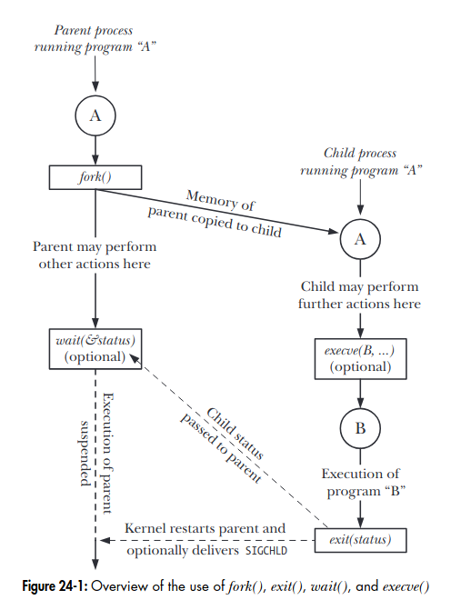

---
# You can also start simply with 'default'
theme: seriph
background: https://raw.githubusercontent.com/bcumming/envvars-talk/refs/heads/main/title.png
# some information about your slides (markdown enabled)
title: HPC Environments
info: |
  Getting started
# apply unocss classes to the current slide
class: text-center
# https://sli.dev/features/drawing
drawings:
  persist: false
# slide transition: https://sli.dev/guide/animations.html#slide-transitions
transition: slide-left
# enable MDC Syntax: https://sli.dev/features/mdc
mdc: true
---

# HPC Environments

<!--
The last comment block of each slide will be treated as slide notes. It will be visible and editable in Presenter Mode along with the slide. [Read more in the docs](https://sli.dev/guide/syntax.html#notes)
-->

---
transition: slide-left
---

# What is an Environment?

We all intuitively understand what an environment is.

User ticket: "my application that worked last week stopped working"

Reply: "tell me about your environment":

<br>

- I load `PrgEnv-gnu`, then `cray-python`, then `cd $HOME/magic` and `source activate.sh`
- I am using a Python venv that I created 2 years ago on `$DEPRECATED_SYSTEM`
- I set `LD_LIBRARY_PATH` in by `.bashrc` - I can't remember why I do that - does that matter?
- I just copied the modules that I used on Daint
- I am using a container
<br>
<br>

But it helps to stop and ask - **what is an environment?**


<!--
a comment
-->

---
transition: slide-left
---

# Part 1: Environment Variables

are everywhere...

### they affect runtime behavior of applications...

```bash
export PATH=$HOME/.local/bin:$PATH
export LD_LIBRARY_PATH=/apps/empa/cp2k/lib64
export XDG_CONFIG_HOME=$HOME/.local/$(uname -m)
export LC_ALL= # ... also affects build time.
```

### they control how software is built...

```bash
export CUDA_HOME=/opt/nvidia/cuda/12.4
export CFLAGS="-fopenmp"
```

### they are a shadowy cabal...

.. that exert [arcane and unfathomable](https://www.gnu.org/software/gettext/manual/html_node/Locale-Environment-Variables.html) control over the daily affairs of mortal users.

---
layout: two-cols
layoutClass: gap-2
---

# Where do environment variables come from?

Start with the origin story of your process

What happens when I type `ls -al` in `bash`?
* bash: calls `fork` to create a new process (a copy of the current process)
* bash: create a new environment `const char** envp` (defaults to copying the calling env)
* bash: call `execve("ls", ["-al"], envp)` (replace the forked process with the new application)
* kernel: copy `envp_` -> `envp`
* kernel: call `main(2, ["ls", "-al"], envp_)`

An excellent [LWN article with a more detail](https://lwn.net/Articles/630727/).

::right::



From [The Linux Programming Interface](https://broman.dev/download/The%20Linux%20Programming%20Interface.pdf) (Michael Kerrisk)

---
layout: two-cols
layoutClass: gap-2
---

# Where are a processes' env. variables defined?

Applications are "started" using the `execve()` system call

```c
#include <unistd.h>
int execve(const char *path, char *const argv[],
           char *const envp[]);
```

> `execve()` does not return on success, and the text, initialized data, uninitialized data (bss), and stack of the calling process are overwritten according to the contents of the newly loaded program.

`envp_` is a null terminated list of variable definitions of the `KEY=VALUE`:
```
envp_ = ["PATH=/usr/bin:/usr/local/bin"
         "LANG=fr_CH.UTF-8",
         NULL]
```

::right::

The c++ standard defines two prototypes for `main`
```c
int main(void);
int main(int argc, char *argv[]);
// and implementation-defined signatures
```

The implementation-defined signature on Linux is
```c
int main(int argc, char *argv[], char *envp[])
```

Where `envp` is the environment passed to `execve`

* the kernel allocates and populates `envp` before `main` is called
    * the kernel [may modify some environment variables](https://github.com/bminor/glibc/blob/master/sysdeps/generic/unsecvars.h)
* `envp` is private/local to this process

---
layout: two-cols
layoutClass: gap-2
---

# `envp` is...

**a set of per-process global variables**
<br>

```c
extern char **environ; // who allocates this? it depends!
```
A null-terminated list of pointers to strings:
```c
"NAME=VALUE"
```

No hash table, entries are not alphabetically sorted, and the only way to find the number of entries is to iterate over the entire list until we hit `NULL`.

* `envp` is private to each process
* a process can not:
    * access or modify its parent's environment
    * access or modify its childrens' environment after it has forked.

::right::

## `glibc/stdlib/getenv.c`

```c
char *getenv(const char *name) {
  size_t len = strlen(name);
  char **ep;
  uint16_t name_start;

  if (__environ == NULL || name[0] == '\0')
    return NULL;

  // single character env var tests removed for clarity

  name_start = *(const uint16_t *)name;
  len -= 2;
  name += 2;

  for (ep = __environ; *ep != NULL; ++ep) {
    uint16_t ep_start = *(uint16_t *)*ep;
    if (name_start == ep_start
        && !strncmp(*ep + 2, name, len)
        && (*ep)[len + 2] == '=')
      return &(*ep)[len + 3];
  }
  return NULL;
}

```

---
layout: two-cols
layoutClass: gap-2
---

# What about `setenv`?

More complicated because it modifies `__environ`

[`glibc/stdlib/setenv.c`](https://github.com/lattera/glibc/blob/master/stdlib/setenv.c#L251)

* Come for the implementation, but stay for the [comments](https://github.com/lattera/glibc/blob/master/stdlib/setenv.c#L301-L303).

Unlike `getenv`, calls to `setenv` are guarded by a mutex
* a deadlock can be created when `setenv()` is called at the same time as `fork()` and the mutex state is [lazily copied](https://rachelbythebay.com/w/2014/08/16/forkenv/) into the child process.


::right::

**The catch: `getenv` does not use the mutex.**
* `getenv` might read invalidated environment
* there are at least 4 different ways that a segfault will manifest

> **fun fact** environment variables are thread safe in Windows. This is one of the main causes of [crashes](https://ttimo.typepad.com/blog/2024/11/the-steam-client-update-earlier-this-week-mentions-fixed-some-miscellaneous-common-crashes-in-the-linux-notes-which-i-wante.html) in the Steam for Linux port.

All use of `setenv` is fraught with danger.
From the [glibc user manual]()

> Modifications of environment variables are not allowed in multi-threaded programs

To ensure a crash free program: **Never use environment variables!**

---
layout: two-cols
layoutClass: gap-4
---

# How is the initial environment set?

It depends!

For a login bash shell the following scripts are sourced:
* **System-wide variables**: `/etc/profile` → `/etc/profile.d/*.sh`
* **User variables**: `~/.bash_profile` (or `~/.bash_login` or `~/.profile`)
* **Interactive settings**: `~/.bashrc`

The precise set of scripts depends on your distribution and configuration.

These variables are then passed down.

::right::

Some examples of tasks that are not run with `/etc/profile` and friends:

**cron jobs**

```
* * * * * job.sh
# fix:
* * * * * . /etc/profile; . ~/.bashrc; job.sh
```

**ssh non interactive jobs**

```bash
ssh user@host 'echo $PATH'
# fix:
ssh user@host 'bash -l -c "echo $PATH"'
```

**sudo commands**

```bash
sudo job.sh
# fix: simulate an interactive shell
sudo -i job.sh
# fix: preserve the calling environment
sudo -E job.sh
```

---

# SLURM does not run a shell on compute nodes

It executes directly on the compute node:

* `srun` and `sbatch` make a copy of the environment on the login node
* this is modified, then passed to the SLURM controller
* the slurm controller forwards this bundle to the SLURM daemon on the compute nodes
* the daemon starts a new process on each compute node
* the process is `fork()`ed `num-tasks-per-node - 1` times
* each fork calls `execve` with the packaged environment

This is why you need to use `spank_setenv` and `spank_getenv` in SLURM plugins

* to modify SLURM's internal data structure that maintains the environment for `execve`

This mechanism is the only way I have found for passing state between login and compute nodes in SLURM plugins.

* let me know if you know another way (that doesn't touch the file system)

---

# We live in the real world

Environment variables can't be avoided
* often the only way to communicate some information at runtime to some applications and libraries.
    * e.g. passing state from srun/sbatch to a plugin on a compute node
* some dependencies will use them

For example, [OpenSSL uses them gratuitously](https://docs.openssl.org/3.1/man7/openssl-env/), but that's okay!

> The OpenSSL libraries use environment variables to override the compiled-in default paths for various data. To avoid security risks, the environment **is usually not consulted** when the executable is set-user-ID or set-group-ID.

**Be aware of the dangers, and try to mitigate the risks**

---

# When to use environment variables

Sometimes they are appropriate, or the benefits of the easy solution outweigh the cost of the right solution

* because you maintain an established code/domain that [uses environment vars](https://mesonbuild.com/meson-python/reference/environment-variables.html).
* to comply with a standard, e.g. [`XDG_CONFIG_HOME`](https://specifications.freedesktop.org/basedir-spec/latest/) or [`NO_COLOR`](https://no-color.org/)
    * looking at you [Docker](https://github.com/moby/moby/issues/20693) (JFrog, Podman, and friends all use `$HOME/.docker`)
    * that 8 year old ticket illustrates the importance of making the right decision early is so important.
    * how would `export XDG_CONFIG_HOME=$HOME/$(uname -m)/config` help on Alps?
* because it is easy compared to the "correct solution"

**Hint 1**: Perform all `getenv` calls before any call to fork.
* +10 points for parsing the environment into a read only data structure on startup

**Hint 2**: Do not use `setenv`
* if a dependency requires it... can you really trust it?
* pass `envp` explicitly to `execve` if you need to modify the environment

---
layout: two-cols
layoutClass: gap-16
---

# How to reduce use of environment variables?

Environment variables are mutable global variables. Treat them as such.

In C++ we try to make functions _pure_

```cpp
string default_path;
void foo();
{ /* use default_path */ }
int main(int argc, char** argv) {
    default_path = set_params(argv);
    foo();
}
```
```cpp
struct params {string default_path;};
void foo(const string& default_path);
{ /* use default_path */ }
int main(int argc, char** argv) {
    const params = set_params(argv);
    foo(params.default_path);
}
```

::right::

Instead of:

```bash
export MYAPP_MAXITERS=100
export MYAPP_COLOR=0
myapp
```

pass parameters as CLI arguments:

```bash
myapp --max-iters=100 --no-color
```

or use a configuration file:

```bash
vim $XDG_CONFIG_HOME/myapp/config
myapp --no-color
```

Both approaches are more **declarative**: the environment is concretely defined at time of execution as CLI arguments or a configuration file.

---
layout: two-cols
layoutClass: gap-2
---

# How does `module load` work?

A process can't modify its parent's environment, so how does `module` change `PATH` etc.?

**STEP 1: write an application that prints shell commands to `stdout`**

```c
// set-message_.c
#include <stdio.h>
int main() {
  printf("export MESSAGE='all your env are ours'\n");
}
```
test it out
```bash
> gcc impl.c -o set-message_
> ./set-message_
echo MESSAGE='all your env are ours'
```

::right::

**STEP 2: Export a bash function that calls the impl and echos the output to the shell**

```bash
> set-message() { eval "$(set-message_)"; };
> export -f set-message
> type set-message
set-message is a function
set-message ()
{
    eval "$(set-message_)"
}
> set-message
> echo $MESSAGE
all your env are ours
```

**That's all there is to it?**

the `module` command on daint boils down to:
```bash
eval "$(/opt/cray/pe/lmod/lmod/libexec/lmod shell "$@")"
```

the old uenv [did the same thing](https://github.com/eth-cscs/uenv/blob/master/activate#L56).

---
layout: two-cols
layoutClass: gap-2
---

# The Other Components of an Environment
It's always the filesystem!

The **file system** is the other half (in user land)
* ignoring **the kernel, drivers and kernel modules**

More specifically the contents of the filesystem, consider **prefix variables** like `PATH`, `LD_LIBRARY_PATH` and `PKG_CONFIG_PATH`:
* colon separated list of search paths
* they are searched to find executables, libraries for runtime linking, pkgconfig definitions during build configuration..
* modify or delete a path, and runtime behavior can change...

::right::

```
# PATH is a list of two paths
> echo $PATH
/home/bcumming/.local/bin:/usr/bin

# rg is in the first path
> which rg
/home/bcumming/.local/bin/rg

> rg --version
ripgrep 13.0.0 (rev af6b6c543b)
-SIMD -AVX (compiled)
+SIMD +AVX (runtime)

# modify the first path (delete rg)
> rm /home/bcumming/.local/bin/rg

# ... and behavior changes
> which rg
/usr/bin/rg

> rg --version
ripgrep 14.1.1
features:+pcre2
simd(compile):+SSE2,-SSSE3,-AVX2
simd(runtime):+SSE2,+SSSE3,+AVX2
```

---

# Containers know this...

Container runtimes provide many features, mostly focussed on "isolation" of things like memory, processes, network.

How to isolate the filesystem?

1. create a directory
2. create the new directory tree with the "filesystem" that you want in your environment
    * use squashfs or overlayfs for extra points
3. create a new process with root (`/`) mapped to this new directory

Each step can be done different ways, with varying levels of sophistication.

Container runtimes also give control the environment variables set inside the container.
* no inheriting environment variables

Every time you start the container, you have the same file system and environment variables

---

# uenv knows this

Instead of replacing the host file system, uenv mounts a read only directory path at a fixed location
* usually `/user-environment`
* two uenv can't be mounted at the same location
* this lack of composability was a deliberate design decision to improve reproducibility
    * users will mix and match if given the chance
    * c.f. `uenv start prgenv-gnu --view=default; module load cray;`

Environment variables are inherited from the host shell/process
* a view is a set of rules for modifying the environment of the calling process
* the view must be specified at startup with the`--view` flag
    * environment variables are set "declaratively"...
    * support for `uenv view` and `uenv modules` that modified the environment of a running uenv was removed

---


# Code Smells

* A long `.bashrc`
    * keep it simple!
* the NVSHMEM build process uses CMake
    * and provides any army of env vars to [configure the build](https://github.com/eth-cscs/cufftmp-spack?tab=readme-ov-file#nvshmem)
* [CMake](https://cmake.org/cmake/help/latest/command/set.html#set) has a complicated system for setting environment variables. Why?
* installing and managing environments with Python, which prompted the following:
    * 
* the `module` command (not the usr's fault if that is all we give them)
    * [installing deepmd on LUMI](https://gist.github.com/bcumming/b65648394ee050874a627fe8e81d3364)
    * also observe the joys of building from source via pip
* and the KitWare award for stellar design goes to... Ben Cumming for his efforts on uenv2!
    * [calling getenv deep into execution](https://github.com/eth-cscs/uenv2/blob/main/src/cli/run.cpp#L62)
    * [calling setenv even later... to pass state to `execve`](https://github.com/eth-cscs/uenv2/blob/main/src/uenv/env.cpp#L401)

---

# Rose Gardens

* `meson.build` and [`meson_options.txt`](https://gitlab.freedesktop.org/xorg/xserver/-/blob/master/meson_options.txt?ref_type=heads)
    * declare all arguments in one place
    * [no environment variables](https://github.com/mesonbuild/meson/discussions/13811).
* `uenv run`: wrap each command with its executation environment
    ```
    uenv run --view=default prgenv-gnu ./simulation.sh
    uenv run --view=default netcdf-tools ./generate-images.sh
    ```
    * also passing `--uenv` to each `srun` call in an sbatch script
* Environment Description Files (EDF) in the container engine
* using [`uv`](https://docs.astral.sh/uv/guides/install-python/) [instead of pip](https://github.com/eth-cscs/cscs-docs/blob/main/serve)

---

# The End

<br>

Thanks for watching.
